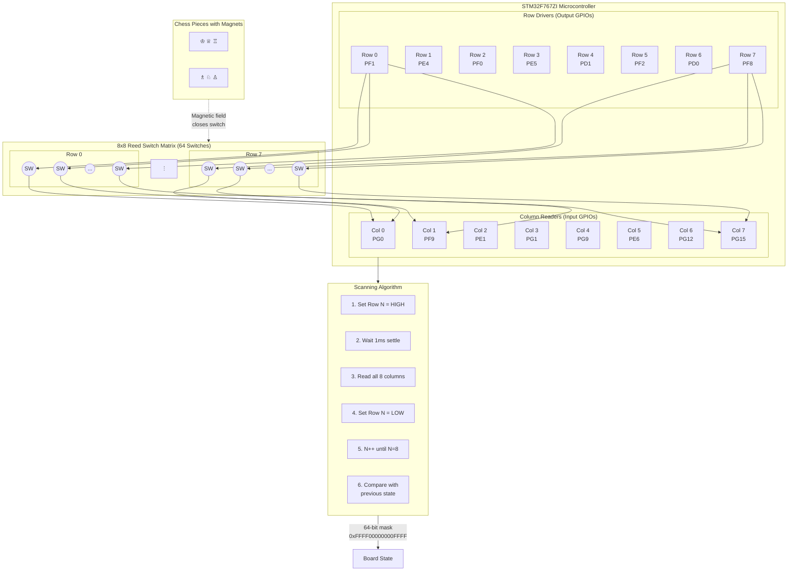

# Reed Switch Matrix Multiplexing Principle

This diagram explains the row-column matrix scanning technique used to detect chess piece positions using reed switches and magnets.

## Concept Overview

The chessboard uses an **8×8 matrix** of reed switches (64 total switches) to detect piece positions. Each chess piece has a magnet embedded in its base. When a piece is placed on a square, the magnet closes the reed switch beneath it.

To read 64 switches with only **16 GPIO pins** (8 rows + 8 columns), we use **multiplexed scanning**.

## Hardware Configuration

| GPIO Type | Count | Pins | Configuration |
|-----------|-------|------|---------------|
| **Row Drivers** | 8 | PF1, PE4, PF0, PE5, PD1, PF2, PD0, PF8 | Output, Active High |
| **Column Readers** | 8 | PG0, PF9, PE1, PG1, PG9, PE6, PG12, PG15 | Input, Pull-up |

## Matrix Diagram



## Scanning Algorithm

The scanning algorithm activates one row at a time and reads all columns:

### Pseudocode

```
function board_driver_scan():
    state = 0 (64-bit)
    
    for row = 0 to 7:
        // Step 1: Activate current row
        gpio_set(row_pins[row], HIGH)
        
        // Step 2: Wait for signal to settle
        sleep(1ms)
        
        // Step 3: Read all columns
        for col = 0 to 7:
            if gpio_get(col_pins[col]) == HIGH:
                state |= (1 << (row * 8 + col))
        
        // Step 4: Deactivate row
        gpio_set(row_pins[row], LOW)
        
        // Step 5: Inter-row delay
        sleep(10ms)
    
    return state  // 64-bit occupancy mask
```

### Timing Parameters

| Parameter | Value | Purpose |
|-----------|-------|---------|
| Settle time | 1 ms | Allow signals to stabilize after row activation |
| Inter-row delay | 10 ms | Prevent ghosting between rows |
| Full scan time | ~88 ms | Complete 8-row scan cycle |
| Scan interval | 100 ms | Application layer polling rate |

## Physical Principle

```
Reed Switch Operation:
                                    
    ┌──────────────────────┐       
    │  No Magnet Present   │       
    │                      │       
    │   ┌──┐    ┌──┐      │  → Switch OPEN (no current)
    │   │  │    │  │      │       
    │   └──┘    └──┘      │       
    └──────────────────────┘       
                                    
    ┌──────────────────────┐       
    │  Magnet Present (♟)  │       
    │        ↓↓↓↓          │       
    │   ┌──┐════┌──┐      │  → Switch CLOSED (current flows)
    │   │  │    │  │      │       
    │   └──┘    └──┘      │       
    └──────────────────────┘       
```

When a chess piece with a magnet is placed on a square:
1. The magnetic field closes the reed switch contacts
2. Current can flow from the active row to the column
3. The column GPIO reads HIGH (with pull-up: LOW when closed, inverted in software)

## Board State Representation

The 64-bit mask efficiently represents all 64 squares:

```
Bit Position = (row × 8) + column

Example: Initial chess position
Rows 0-1: Black pieces → bits 0-15 set
Rows 2-5: Empty       → bits 16-47 clear  
Rows 6-7: White pieces → bits 48-63 set

occupied_mask = 0xFFFF00000000FFFF
```

### Move Detection

```c
// Detect changes between scans
uint64_t changed = old_mask ^ new_mask;
uint64_t removed = old_mask & changed;  // Pieces lifted
uint64_t added   = new_mask & changed;  // Pieces placed

// Simple move: 1 removed + 1 added
if (popcount(removed) == 1 && popcount(added) == 1) {
    // Valid move detected!
}
```

## Electrical Schematic (Simplified)

```
        Row 0 (Output)                    Row 1 (Output)
            │                                  │
            ▼                                  ▼
     ┌──────┴──────┐                   ┌──────┴──────┐
     │   ┌─────┐   │                   │   ┌─────┐   │
     ├───┤ SW  ├───┼─────── Col 0 ◄────┼───┤ SW  ├───┤
     │   └─────┘   │         (Input)   │   └─────┘   │
     │   ┌─────┐   │                   │   ┌─────┐   │
     ├───┤ SW  ├───┼─────── Col 1 ◄────┼───┤ SW  ├───┤
     │   └─────┘   │         (Input)   │   └─────┘   │
     │     ...     │                   │     ...     │
     │   ┌─────┐   │                   │   ┌─────┐   │
     └───┤ SW  ├───┼─────── Col 7 ◄────┼───┤ SW  ├───┘
         └─────┘   │         (Input)   │   └─────┘
                   │                   │
```

## Configuration (Device Tree)

From `nucleo_f767zi.overlay`:

```dts
chess_board: chess-board {
    compatible = "custom,chess-board-matrix";
    
    row-gpios = <&gpiof 1 GPIO_ACTIVE_HIGH>,   /* Row 0 */
                <&gpioe 4 GPIO_ACTIVE_HIGH>,   /* Row 1 */
                ...
                <&gpiof 8 GPIO_ACTIVE_HIGH>;   /* Row 7 */

    col-gpios = <&gpiog 0 GPIO_ACTIVE_HIGH>,   /* Col 0 */
                <&gpiof 9 GPIO_ACTIVE_HIGH>,   /* Col 1 */
                ...
                <&gpiog 15 GPIO_ACTIVE_HIGH>;  /* Col 7 */

    pull-up;              /* Use internal pull-up resistors */
    switch-active-high;   /* Closed switch = HIGH reading */
};
```

## Advantages of Matrix Multiplexing

| Benefit | Description |
|---------|-------------|
| **Pin Efficiency** | 16 GPIOs for 64 switches (vs 64 individual pins) |
| **Scalability** | N×M matrix needs only N+M pins |
| **Simplicity** | No additional ICs required |
| **Reliability** | Reed switches are wear-resistant (no mechanical contacts) |

## Limitations

| Limitation | Mitigation |
|------------|------------|
| Ghosting (false readings) | Sequential row activation, settle delays |
| Scan latency (~100ms) | Acceptable for human chess play speed |
| Single-point detection | Each square has exactly one switch |
