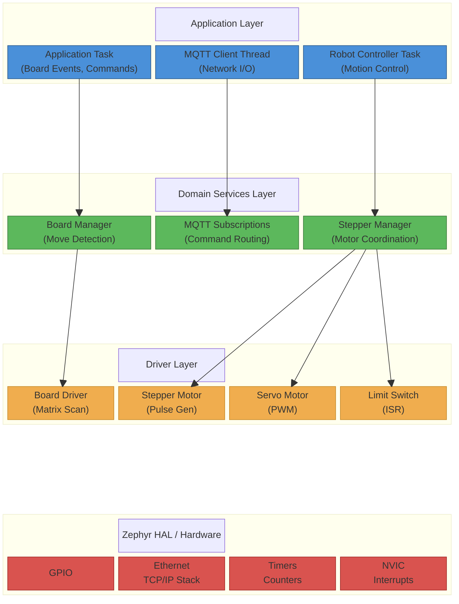

# Software Architecture and Threading Diagram

This diagram illustrates the layered software architecture and threading model of the Schachroboter firmware.

## Architecture Overview

The firmware follows a **layered architecture** with clear separation of concerns:

1. **Application Layer** - Three concurrent RTOS threads handling high-level logic
2. **Domain Services Layer** - Business logic and coordination
3. **Driver Layer** - Hardware abstraction for peripherals
4. **HAL Layer** - Zephyr RTOS and STM32 hardware interfaces

## Threading Model

| Thread | Stack | Priority | Responsibility |
|--------|-------|----------|----------------|
| **Application Task** | 4 KB | 5 | Board scanning, event publishing, command handling |
| **MQTT Client Thread** | 4 KB | 5 | Network I/O, broker connection, message routing |
| **Robot Controller Task** | 2 KB | 5 | Stepper pulse generation, position tracking, homing |

All threads run at equal priority (cooperative scheduling) with preemption.

## Diagram

## Layer Descriptions

### Application Layer (Blue)
- **Application Task**: Orchestrates board scanning at 100ms intervals, detects chess moves, publishes state changes via MQTT, handles incoming robot commands
- **MQTT Client Thread**: Maintains persistent connection to broker, manages subscriptions, handles publish/subscribe message flow
- **Robot Controller Task**: Executes motion commands, manages stepper motor timing, coordinates multi-axis movements

### Domain Services Layer (Green)
- **Board Manager**: Tracks 64-bit occupancy mask, detects move patterns (simple moves, castling, captures)
- **MQTT Subscriptions**: Routes incoming messages to appropriate handlers based on topic
- **Stepper Manager**: Coordinates 5 motors (X, Y1, Y2, Z, Gripper), handles synchronized Y-axis movement

### Driver Layer (Orange)
- **Board Driver**: Implements row-by-row matrix scanning for reed switch array
- **Stepper Motor**: Software-based pulse generation with position tracking
- **Servo Motor**: PWM control for gripper/auxiliary actuators
- **Limit Switch**: GPIO interrupt handlers for homing and safety stops

### Hardware Abstraction Layer (Red)
- **Zephyr RTOS APIs**: GPIO, Network stack, Timer subsystems
- **STM32F767 Peripherals**: Direct hardware access where needed (NVIC, etc.)

## Data Flow

1. **Board State Flow**: Reed switches → Board Driver → Board Manager → MQTT → Host Application
2. **Command Flow**: Host → MQTT → Application → Robot Controller → Stepper Motors
3. **Safety Flow**: Limit Switch ISR → Emergency Stop → Motor Position Reset
