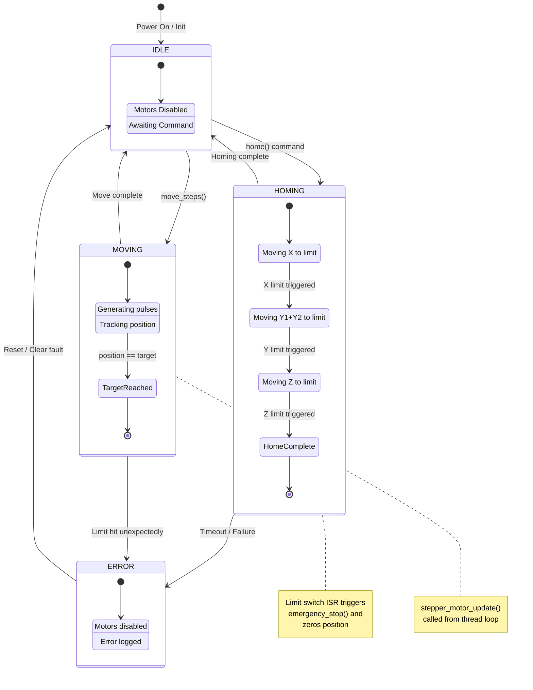

# Stepper Motor State Machine

This statechart describes the state machine governing the robot controller and stepper motor subsystem.

## States Overview

| State | Description | Entry Condition |
|-------|-------------|-----------------|
| **IDLE** | Motors disabled, awaiting commands | Power on, move complete, homing complete |
| **HOMING** | Sequential axis homing to limit switches | `home()` or `home_all()` command |
| **MOVING** | Active pulse generation, position tracking | `move_steps()` command |
| **ERROR** | Fault condition, motors disabled | Timeout, unexpected limit, failure |

## State Machine Diagram



## State Transitions

### IDLE State
- Default state after initialization
- Motors are disabled (TB6600 ENABLE pin inactive)
- System awaits commands via MQTT or direct API calls

**Transitions:**
- `robot_controller_home()` → **HOMING**
- `robot_controller_move_to(x, y, z, speed)` → **MOVING**

### HOMING State
- Sequential homing of all three axes (X → Y → Z)
- Motors move continuously in homing direction until limit switch triggers
- Limit switch ISR calls `stepper_motor_emergency_stop()` and zeros position

**Substates:**
1. **HomingX**: X-axis moves toward limit switch (CCW direction)
2. **HomingY**: Y1 and Y2 motors move synchronized toward Y limit
3. **HomingZ**: Z-axis moves toward limit switch
4. **HomeComplete**: All positions zeroed, ready for operation

**Transitions:**
- All limits triggered → **IDLE**
- Timeout (no limit within expected time) → **ERROR**

### MOVING State
- Active motion with pulse generation
- `stepper_motor_update()` called continuously from robot controller thread
- Position incremented/decremented with each pulse

**Substates:**
1. **Stepping**: GPIO pulse generation, timing based on `step_delay_us`
2. **TargetReached**: `current_position == target_position`

**Transitions:**
- Target position reached → **IDLE**
- Unexpected limit switch trigger → **ERROR**
- `stepper_motor_stop()` called → **IDLE**

### ERROR State
- Fault condition detected
- All motors immediately disabled
- Error logged via Zephyr logging subsystem
- Requires explicit reset to recover

**Transitions:**
- Reset command or reinitialization → **IDLE**

## Code Mapping

| State | Code Constant | File |
|-------|--------------|------|
| IDLE | `STEPPER_STATE_IDLE` | stepper_motor.h |
| MOVING | `STEPPER_STATE_MOVING` | stepper_motor.h |
| HOMING | `STEPPER_STATE_HOMING` | stepper_motor.h |
| ERROR | `STEPPER_STATE_ERROR` | stepper_motor.h |

### Homing State Machine (robot_controller.h)

```c
typedef enum {
    HOMING_STATE_IDLE = 0,
    HOMING_STATE_X,
    HOMING_STATE_Y,
    HOMING_STATE_Z,
    HOMING_STATE_COMPLETE,
    HOMING_STATE_ERROR
} homing_state_t;
```

## Safety Considerations

1. **Limit Switch ISR Safety**: `stepper_motor_emergency_stop()` is ISR-safe (no RTOS calls)
2. **Position Zeroing**: Occurs atomically in limit switch callback
3. **Watchdog**: Homing timeout prevents infinite movement if limit switch fails
4. **Error Recovery**: Explicit reset required to exit ERROR state
